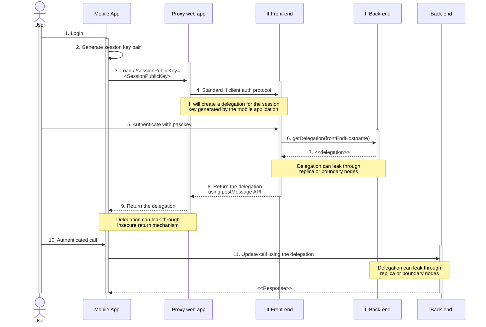
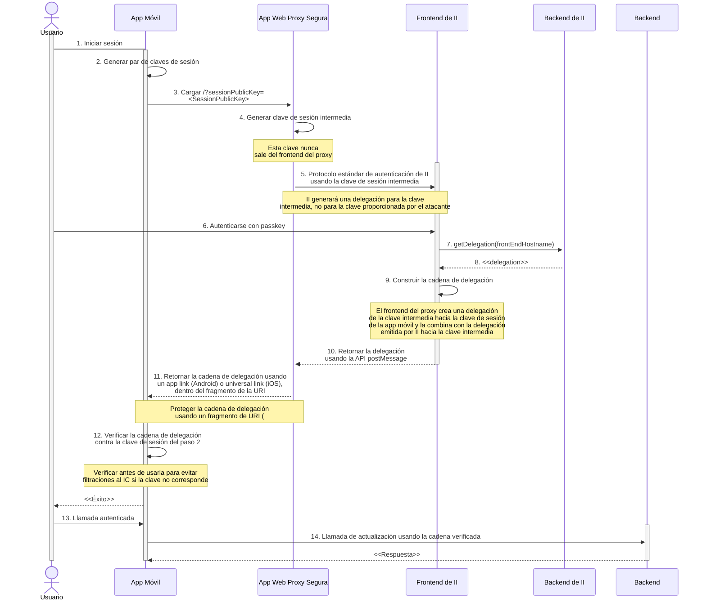

---
keywords:
  [
    security,
    concept,
    identity,
    authentication,
    anonymous principal,
    message inspection,
    agent,
  ]
---

import { MarkdownChipRow } from "/src/components/Chip/MarkdownChipRow";

# Mejores prácticas de seguridad: Gestión de identidad y acceso

<MarkdownChipRow labels={["Seguridad", "Mejores prácticas"]} />

## Asegúrate de que ciertas acciones del usuario requieran autenticación

### Preocupación de seguridad

Si esto no se cumple, un atacante podría realizar acciones sensibles en nombre
de un usuario, comprometiendo su cuenta.

### Recomendación

- El llamador de cada llamada al canister puede ser identificado. El
  [principal](/docs/references/ic-interface-spec#principal) que realiza la
  llamada puede accederse usando los métodos de la API del sistema
  [`ic0.msg_caller_size` y `ic0.msg_caller_copy`](/docs/references/ic-interface-spec#system-api-imports).  
  Si se utiliza un proveedor de identidad como Internet Identity,  
  [el principal es la identidad del usuario para ese origen específico](/docs/references/ii-spec#identity-design-and-data-model).  
  Si algunas acciones (por ejemplo, el acceso a los datos de una cuenta o
  ciertas operaciones específicas de usuario) deben restringirse a un principal
  o a un conjunto de principales, esto debe verificarse explícitamente en la
  llamada al canister. A continuación se muestra un ejemplo en Rust:

```rust
// Supongamos que pk es la clave pública de un principal autorizado para realizar esta operación.
// Este pk podría almacenarse en el estado del canister.
if caller() != Principal::self_authenticating(pk) { ic_cdk::trap(...) }

// Alternativamente, si el canister mantiene datos para diferentes principales
// en un mapa como BTreeMap<Principal, UserData>, entonces el canister
// debe asegurarse de que cada llamador solo acceda y realice operaciones
// sobre sus propios datos:
if let Some(user_data) = user_data_store.get_mut(&caller()) {
    // realizar operaciones sobre los datos del usuario
}
```

- En Rust, se puede usar el crate `ic_cdk` para autenticar al llamador usando
  `ic_cdk::api::caller`. Asegúrate de que el principal retornado sea del tipo
  `Principal::self_authenticating` e identifica la cuenta del usuario usando la
  clave pública de ese principal. Mira el ejemplo anterior.

- Haz la autenticación lo antes posible dentro de la llamada para evitar
  acciones no autenticadas u operaciones costosas antes de la autenticación.  
  También es una buena idea
  [denegar el servicio a usuarios anónimos](#disallow-the-anonymous-principal-in-authenticated-calls).

- No confíes en la autenticación realizada durante la
  [inspección de mensajes de ingreso](#do-not-rely-on-ingress-message-inspection).

## Rechaza al principal anónimo en llamadas autenticadas

### Preocupación de seguridad

El llamador obtenido desde la API del sistema (por ejemplo, `ic0::api::caller`
en Rust) podría devolver `Principal::anonymous()`.  
En llamadas autenticadas, esto es probablemente indeseado y podría tener
implicaciones de seguridad, ya que se comportaría como una cuenta compartida
para cualquiera que haga llamadas sin autenticarse.

### Recomendación

En llamadas autenticadas, asegúrate de que el llamador no sea anónimo y devuelve
un error o _trap_ si lo es. Esto puede hacerse de forma centralizada usando una
función auxiliar. Aquí hay un ejemplo en Rust:

```rust
fn caller() -> Result<Principal, String> {
    let caller = ic0::api::caller();
    // No se permite que el principal anónimo interactúe con el canister.
    if caller == Principal::anonymous() {
        Err(String::from(
            "No se permite que el principal anónimo realice llamadas.",
        ))
    } else {
        Ok(caller)
    }
}
```

## No confíes en la inspección de mensajes de ingreso

### Preocupación de seguridad

La ejecución correcta de
[`canister_inspect_message`](/docs/references/ic-interface-spec#system-api-inspect-message)
no está garantizada, ya que es ejecutada por un único nodo, y si ese nodo es
malicioso, podría simplemente omitir la verificación.  
En ese caso, la llamada de actualización se ejecutaría sin ningún control de
inspección del mensaje.

Además, en las llamadas entre canisters, `canister_inspect_message` **no se
invoca**.

### Recomendación

Tus canisters no deben confiar en la ejecución correcta de
`canister_inspect_message`.  
Esto significa en particular que ningún código crítico para la seguridad, como
los
[controles de acceso](#make-sure-specific-user-actions-require-authentication),
debe realizarse solo en ese método.  
Dichos controles **deben** implementarse como parte de un método de
actualización para garantizar una ejecución confiable.  
Idealmente, se ejecutan tanto en la función `canister_inspect_message` como en
una función de verificación adicional.

## Usa un servicio de autenticación bien auditado y bibliotecas ICP del lado cliente

### Preocupación de seguridad

Implementar la autenticación de usuarios y las llamadas a canisters por tu
cuenta en una aplicación web es propenso a errores y riesgoso.  
Por ejemplo, si las llamadas a canisters se implementan desde cero, puede haber
errores en la creación o verificación de firmas.

### Recomendación

- Considera usar un proveedor de identidad como
  [Internet Identity](https://github.com/dfinity/internet-identity) para la
  autenticación,  
  utiliza el [agente de JavaScript de ICP](https://github.com/dfinity/agent-js)
  para hacer llamadas a canisters,  
  y el
  [auth-client](https://github.com/dfinity/agent-js/tree/main/packages/auth-client)  
  para interactuar con Internet Identity desde tu dapp.

- Puedes considerar frameworks alternativos de autenticación en ICP.

## Configura un tiempo de expiración de sesión apropiado

### Preocupación de seguridad

Actualmente, Internet Identity emite delegaciones con un tiempo de expiración.  
Este tiempo de expiración puede configurarse en el
[auth-client](https://github.com/dfinity/agent-js/tree/main/packages/auth-client).  
Una vez que expira la delegación, el usuario debe volver a autenticarse.  
Establecer un buen valor implica un equilibrio entre seguridad y usabilidad.

### Recomendación

Consulta las
[recomendaciones de OWASP](https://cheatsheetseries.owasp.org/cheatsheets/Session_Management_Cheat_Sheet.html#session-expiration).  
Para aplicaciones sensibles a la seguridad, debería establecerse un tiempo de
expiración de 30 minutos.

El
[auth-client](https://github.com/dfinity/agent-js/tree/main/packages/auth-client)
soporta
[timeouts por inactividad](https://github.com/dfinity/agent-js/tree/main/packages/auth-client#idle-management).

## No uses `fetchRootKey` en el agente JavaScript de ICP en producción

### Riesgo de seguridad

`agent.fetchRootKey()` puede ser usado en el  
[agente JavaScript de ICP](https://github.com/dfinity/agent-js) para obtener la
clave pública de umbral del _root subnet_ mediante una llamada de estado en
entornos de prueba. Esta clave se usa para verificar firmas de umbral sobre
datos certificados recibidos a través de llamadas de actualización a
_canisters_. Usar este método en una aplicación web en producción le da al
atacante la posibilidad de suministrar su propia clave pública, invalidando
todas las garantías de autenticidad de las respuestas de actualización.

### Recomendación

Nunca uses `agent.fetchRootKey()` en entornos de producción, solo en entornos de
prueba. Si no se llama a este método, se usará la clave pública del _root
subnet_ del mainnet, la cual está codificada directamente en el agente, lo que
es el comportamiento deseado en producción.

## Integración de Internet Identity en dispositivos móviles

Una [presentación breve](https://www.youtube.com/watch?v=iRmpCkzC6iI&t=1863s)
está disponible como parte del R&D global de noviembre 2024.

### Riesgo de seguridad

Internet Identity (II) proporciona una forma estandarizada para que las
aplicaciones web soliciten la autenticación de un usuario. Este  
[protocolo de autenticación del cliente](/docs/references/ic-interface-spec#client-authentication-protocol)  
permite a una dapp frontend obtener una delegación firmada por II para un par de
claves de sesión generado localmente. Esta delegación, combinada con la clave
privada de sesión, permite que la dapp realice llamadas autenticadas al canister
backend. Estas llamadas deben estar firmadas digitalmente por la clave privada
de sesión. El IC verificará la firma y también si existe una delegación (o
cadena de delegaciones) desde la clave de II hasta la clave pública de sesión.

El protocolo usa la API `postMessage` del navegador para comunicarse entre el
origen del cliente y el de II. Esto permite a II autenticar el origen de la
solicitud usando el nombre del host.

:::info

Como parte del protocolo, una dapp puede especificar un origen alternativo si
cumple con los requisitos de  
[orígenes alternativos de frontend](/docs/references/ii-spec#alternative-frontend-origins).

:::

Tras una autenticación exitosa, II retorna una delegación para el _principal_
derivado del II del usuario para el origen de frontend específico. Esto cumple
dos propósitos:

1. Una dapp no puede usar esa delegación en otras dapps para hacerse pasar por
   el usuario.
2. Múltiples dapps no pueden correlacionar el comportamiento del usuario entre
   ellas, mejorando así la privacidad.

Una dapp con un origen diferente no podrá solicitar autenticación para tu
aplicación, lo que protege contra ciertos ataques de _phishing_.

Integrar una aplicación móvil con II no es tan sencillo, ya que una app móvil no
puede usar la API `postMessage`. Es tentador crear un “proxy” web simple,
servido por la dapp, como se muestra en el siguiente diagrama de secuencia. La
app móvil puede cargar este proxy para completar el flujo de autorización
normal. Al finalizar, este proxy web devuelve la delegación a la app móvil.

**Diagrama de secuencia de una implementación ingenua:**



Sin precauciones, este proxy aceptaría solicitudes maliciosas para autenticar al
usuario y podría devolver la delegación a un atacante.

El ataque funcionaría así: el atacante lanza una app móvil/web maliciosa y
convence al usuario de autenticarse usando Internet Identity (II). En lugar de
usar II directamente, el atacante utiliza un proxy vulnerable. Genera una clave
de sesión y solicita al proxy que la use en el flujo de autenticación. II emite
una delegación firmada para el II del usuario, pero atada al origen del frontend
del proxy. Esta delegación podría filtrarse al atacante y usarse para hacerse
pasar por el usuario.

Por ejemplo, si el atacante logra que el proxy redirija a su app maliciosa (por
medio de _deep links_ en Android o _custom schemes_ en iOS), obtendría la
delegación directamente. También podría filtrarse a través del canal inseguro
entre el proxy y la app móvil, o por la observación del estado del IC.

Este ataque requiere cuatro condiciones:

1. El atacante proporciona una clave de sesión que se usa en el protocolo de II.
2. El protocolo se inicia para un `hostname` de frontend específico.
3. El usuario completa el flujo de autenticación con II.
4. El atacante obtiene la delegación firmada por II.

Las condiciones 1 a 3 pueden cumplirse mediante un ataque de _phishing_, usando
una app falsa que redirige al proxy desde una fuente aparentemente legítima. La
víctima cree participar en un _airdrop_, instala una app que solicita
autenticación con II y carga el proxy como lo haría una app legítima. El proxy
inicia el flujo para el origen de la dapp vulnerable, usando la clave de sesión
del atacante.

La condición 4 puede cumplirse si el atacante controla un nodo _boundary_ o una
réplica, y observa la delegación en el paso 7. También puede filtrarse en el
paso 9 si se usa un parámetro GET en la URI hacia el IC. Si la app móvil que
debería manejar la URI no está instalada, el navegador abre la URI y los nodos
podrían ver la delegación. También se puede filtrar si la app móvil hace una
llamada al IC en el paso 11 sin verificar adecuadamente la delegación del
paso 9.

Finalmente, la condición 4 también se puede cumplir si la delegación se devuelve
de manera insegura desde el frontend del proxy a la aplicación móvil. Por
ejemplo, mediante el uso de deep links en Android o esquemas personalizados en
iOS, que pueden ser interceptados por una aplicación maliciosa.

### Recomendación

En la integración estándar entre una app web y el frontend de II, el origen del
cliente se verifica **antes** de iniciar el protocolo de autenticación.  
Desafortunadamente, en el paso 3 del primer diagrama, al cargar el proxy no se
transmite ninguna información sobre la app móvil, por lo que el proxy no puede
autenticar al cliente. Esto lo convierte en un punto vulnerable, como se explicó
anteriormente.

Este riesgo puede mitigarse adoptando las siguientes soluciones, que se ilustran
en el siguiente diagrama de una integración segura:

**Diagrama de secuencia de una integración segura:**



- Introduce una clave de sesión intermedia que se genera y almacena en el
  frontend del proxy de la aplicación web.
- Iniciar el protocolo de autenticación del cliente de II utilizando esta clave
  de sesión intermedia. Al utilizar una nueva clave de sesión que el atacante no
  puede controlar, la delegación emitida por II ya no sería utilizable por el
  atacante si se robara en el paso 8, ya que el atacante no tiene acceso a la
  clave privada de sesión intermedia.
- [Crear una cadena de delegación](/docs/references/ic-interface-spec#authentication)
  para permitir que la aplicación móvil utilice su clave de sesión. La cadena de
  delegación consta de dos delegaciones, como se muestra en la figura a
  continuación. La primera delega desde la clave del canister de II a la clave
  intermedia y es generada por el canister de II. La segunda delega desde la
  clave intermedia a la clave pública de la aplicación móvil y está firmada por
  la clave privada de sesión intermedia del frontend del proxy. Tenga en cuenta
  que esto significa que la clave intermedia puede hacerse pasar por el usuario.
  Dado que el frontend del proxy se sirve desde el IC, se puede confiar en que
  maneje correctamente esta clave. Depende del desarrollador garantizar la
  confidencialidad de esta clave. Por ejemplo, utilizando la API WebCrypto para
  crear claves no extraíbles, como se utiliza internamente por el
  [agente JavaScript ICP](https://www.npmjs.com/package/@dfinity/agent).
  Idealmente, esta clave intermedia tiene una duración corta para reducir el
  riesgo de exposición.


- Devuelve la cadena de delegación a la aplicación móvil utilizando
  [app links](https://developer.android.com/training/app-links) en Android y
  [universal links](https://developer.apple.com/documentation/xcode/allowing-apps-and-websites-to-link-to-your-content)
  en iOS. Estos mecanismos vinculan el nombre de dominio/host al app móvil, lo
  que evita que un atacante use una app móvil maliciosa para recibir la cadena
  de delegación. La vinculación de dominio a app móvil se realiza a través de un
  archivo JSON que debe alojarse en el directorio `/.well-known` de tu
  aplicación web. Consulta la documentación de
  [iOS](https://developer.apple.com/documentation/xcode/supporting-associated-domains)
  y
  [Android](https://developer.android.com/training/app-links/verify-android-applinks)
  para obtener más detalles.
- Devuelve la cadena de delegación a la aplicación móvil utilizando un
  [fragmento de URI](https://www.w3.org/DesignIssues/Fragment.html) (todo lo que
  sigue al # en el URI). El navegador cargará el URI si la app móvil vinculada
  al app/universal link no está instalada en el dispositivo móvil. La ventaja de
  los fragmentos de URI es que no se incluyen en la solicitud al servidor si el
  navegador resolviera el URI. Un parámetro de URL o una ruta se incluirían en
  dicha solicitud y, por lo tanto, filtrarían la cadena de delegación al backend
  de la app proxy (probablemente los nodos boundary y réplica del IC). Un
  fragmento de URI sigue estando disponible para su extracción por parte de la
  app móvil.
- Verifica la cadena de delegación en la aplicación móvil antes de usarla en un
  mensaje del IC. Es probable que la aplicación móvil utilice un agente que no
  verifique si la clave de sesión generada en el paso 2 corresponde a la
  delegación encontrada en la cadena de delegación devuelta en el paso 11.
  Utilizar dicho agente para realizar una llamada de actualización firmada
  simplemente crearía un mensaje con la cadena de delegación proporcionada y la
  firmaría con una clave que no coincide. Obviamente, el IC rechazaría dicho
  mensaje, ya que la firma no corresponde a la cadena de delegación, pero la
  cadena de delegación ya se habría filtrado al boundary y potencialmente a los
  nodos réplica donde un atacante podría robarla.
- Opcionalmente, el frontend del proxy podría advertir explícitamente al usuario
  que está a punto de iniciar sesión con II para tu dapp. Podría incluir el
  nombre y el logotipo de tu dapp. Esto podría alarmar al usuario que está
  siendo víctima de un ataque de phishing, ya que el pretexto utilizado por el
  atacante probablemente no coincidiría con el propósito de tu dapp. Por
  ejemplo, el atacante afirma que la autenticación es necesaria como parte de un
  airdrop mientras tú estás ejecutando un intercambio descentralizado no
  relacionado. Cuando se abre la app proxy, el usuario vería el logotipo de tu
  dapp y abortaría la sesión.

Para obtener más información, consulta una
[implementación de ejemplo en forma de app Unity](https://github.com/dfinity/examples/tree/main/native-apps/unity_ii_deeplink).
Las siguientes partes de esa base de código son las más importantes:

- Generación de la clave de sesión intermedia
  [en index.js](https://github.com/dfinity/examples/blob/main/native-apps/unity_ii_deeplink/ii_integration_dapp/src/greet_frontend/src/index.js#L25).
- [Autenticación utilizando la clave de sesión intermedia](https://github.com/dfinity/examples/blob/main/native-apps/unity_ii_deeplink/ii_integration_dapp/src/greet_frontend/src/index.js#L26-L36)
  en lugar de la clave pública de la app móvil.
- [Generación de la cadena de delegación](https://github.com/dfinity/examples/blob/main/native-apps/unity_ii_deeplink/ii_integration_dapp/src/greet_frontend/src/index.js#L48-L57)
  combinando la delegación obtenida de II con una delegación creada por el
  frontend.
- [Devolver la cadena de delegación utilizando un app link/universal link](https://github.com/dfinity/examples/blob/main/native-apps/unity_ii_deeplink/ii_integration_dapp/src/greet_frontend/src/index.js#L71)
- Devolver la cadena de delegación
  [utilizando un fragmento de URI](https://github.com/dfinity/examples/blob/main/native-apps/unity_ii_deeplink/ii_integration_dapp/src/greet_frontend/src/index.js#L73).
- Actualmente, se está mejorando el ejemplo para verificar también la cadena de
  delegación en la app móvil antes de usarla.
